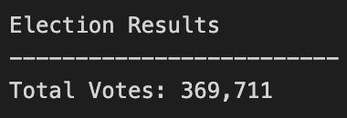
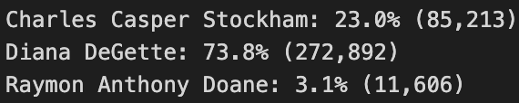
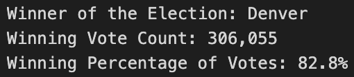
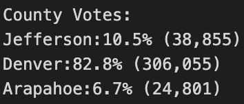
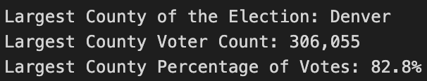

# Election_Analysis
Challenge 3 - This project was writtern with Python and Visual Studio Code

## Overview of Election Audit
An employee from Colorado Board of Election requestted for completing an election audit of the local congressional election.  In the audit system, their should be:
- Total number of votes cast
- A complete list of candidates who received votes
- Total number of votes each candidate received
- Percentage of votes each candidate won
- The winner of the election based on popular vote
With Visual Studio Code, a python file(PyPoll_Challenge.py) was writern for analysing the raw data in the resource([election_results.csv](Resources/election_results.csv))

## Election Audit Results
Based on the audit, here are the results:
- **Total number of Votes cast**: 369,711 votes

     

- **List of candidates: Total Number of Votes Received (Percentage of the Votes Received)**
      * Charles Casper Stockham: 85,213 (23.0%)
      * Diana DeGette: 272,892 (73.8%)
      * Raymon Anthony Doene: 11,606 (3.1%)
      
     
      
- **Winner of the Election**: **Diana DeGette**

     
      

- **Voter Turnout for Each County**

     

- **The Couty with the Largest Turnout**

     

Summary of results details coud be found in **election_results.txt**

## Election Audit Summary

The calculated results of vote was **printed()** throught Python to the **terminal** during analyzing for visulization purpose.

The main culculations are **count the numbers**, **culculate the percentage** and **compare to get the maximium number**.

This is a clear script for the voting activity. We could easily to edit it by **changing variabilities name**, **index of the resources** and **outputing entry** to apply this format of this script on other election activities. 

